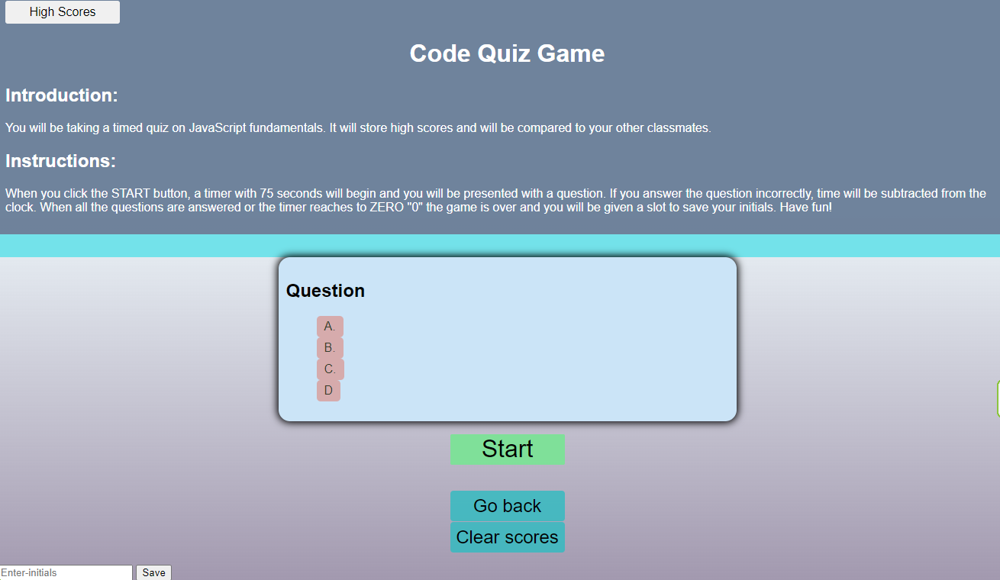
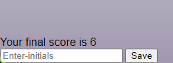

<h1> Description</h1>

This code quiz will give you a set of questions  

<li>When you click the start button a timer will start and you will be presented with a question.</li>
<li>If you answer the question incorrectly time will be subtracted from the clock. </li>
<li> When all questions are answered, or the timer reaches zero the game is over.</li>
<li> When the game is over you can save save your initials and see your score. </li>

 
 
 
